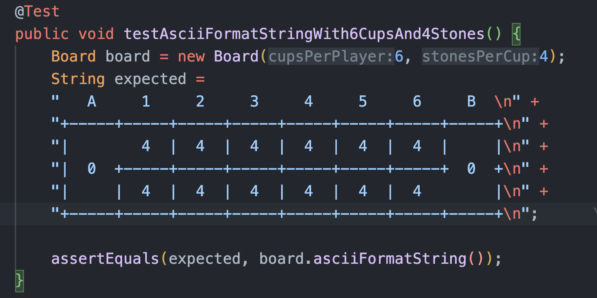

# My Approach

> Note this document is only relevant if you want to know how I came up with the solution. If you are only interested
> in the solution itself, please ignore the rest of the document. Its purpose is to show my thought process and
> how I approach a problem. If on the other hand, you want to go deeper, you can also check out the commit history.

First of all, I do not have any professional experience with Java. I can read and understand the code just fine, but
have never written a project in Java from scratch. While the language itself is not difficult, I believe that the
challenge lies in understanding the various libraries, frameworks, conventions, and the entire ecosystem of a tech
stack. In this regard, "working with frameworks you are familiar with" is an interesting point to consider.

To get started, I searched on Google and YouTube for "Building Java APIs". After quickly scanning through some
materials I'll use the following techniques:

- Spring - as web framework
- JPA - as database layer

I have experience building APIs in .NET Core/C# and NodeJS/TypeScript. Based on this experience, I will use the same
project/layer structure. However, since I am not familiar with Spring, I am unsure if this conforms to convention.

- DTO
- Entity
- Controller
- Service
- Repository

## Functional Requirements

After reading and understanding rules about the game, I come up with the functional requirements of the project.

- Must be a web application → building an API
- Players can register to play the game
- API supports multiple concurrent games
- No frontend design is needed
  - API returns the board in ascii form
  - API returns the board in json (for future frontend implementation)

## Starting the Implementation

I used Spring Boot Initialzr to generate an empty project. After which I sketched a rough outline of the project
how does the data model look like, what is persisted, how do we manipulate the data, what are the controllers,
services …

### Data Model

From this I landed on the following data models:

- Player Entity
  - Makes API requests to play the game (as it should be a web application)
  - Authenticates using JWT token
  - Persisted to database
- Game Entity
  - Contains two players
  - Contains the board
  - Persisted to database
- Board Entity
  - Dimensions / n cups / the board → serialized as an array
  - Amount of stones per cup
  - Persisted to database

## Iterative Development

I prefer to build my solutions incrementally, using an 80/20 approach where I try to accomplish most of the work in the
least amount of time possible. The goal is to strike a balance between pragmatism and (over)engineering. To this end,
I started by implementing the core of the assessment: the game itself.

This is also an easy starting point, as I could implement the game without needing to know much about the Spring / Java
ecosystem. The workflow was:

1. Coming up with the data format (how to store the game) → single array containing all the cups, and stores
2. Implementing a visual representation → ASCII style

   1. This allowed me to see and reason if the rules I'm implementing were right

   

3. Implementing the game

I explicitly kept this pretty low level. I'm aware that often applications developed in Java are built very much using
OOP style. Instead of building helper classes (e.g., `Cell`) and functions (e.g., `isPlayerATurn()`), I just used a
single array and some fields to contain the state.

This allowed me to quickly understand the business needs and achieve the functional requirements of the game efficiently,
without spending too much engineering time on designing an OOP solution. For now, I can check off this box and move on
to building the web application around it. In the future, I might want to revisit this part of the application and
rewrite it to be more enterprise-grade.

> The result of this is the `Board` class found at `src/main/java/dev/joell/kalaha/board/Board.java`.

### Building the Web Application

Regarding the API, I am using Spring and JPA. From my quick research, it seems that these techniques are popular
and are also used at the company. However, I have not spent time finding alternatives or making a comprehensive
comparison, which is something I would usually do if I had more time when learning or implementing a new tech stack.

The entities, implementation and their behavior are pretty self explanatory. I'll just write down how the API evolved
over time:

1. Implementing a Player entity - simple entity without having any external dependencies
   1. Follows several layers of Controller, Service, Repository, Dtos
   2. Start with manual mapping between dto and entity, then found MapStruct library
   3. The entity contains id, name and createdAt field. As of now, the Player entity (or dtos) doesn't have any behaviour / logic.
      1. Therefore I didn't create any unit tests → in future one might test if mapping between layers is correct
      2. Covered the business logic with integration test
2. Implementing the Game
   1. Follows same layers of Controller, Service, Repository and Dto
   2. The controller consists of following routs:
      1. POST /games to create a game where user can configure settings (amount of stones and cups)
      2. GET /games to list all games, GET /games/{id} for single game
      3. GET /games/{id}/pretty which returns the game in pretty ascii format as shown above
      4. POST /games/{id}/move/{cup} makes a move
   3. The GameService delegates the implementation of the game to the previous created Board
      1. This is done by mapping the GameEntity between Board. This works because their data format are equivalent.
3. Next I wanted to add authentication / access control. With the following features:
   1. Players need to register before they can create and play games
   2. Players can only see their own games
   3. Authorization done using jwt
   4. Hash and store the password with bcrypt

At this point, things became a bit complicated, and it seems to require more knowledge about the Spring framework. I
spent about 1-2 hours on this, but didn't get very far. What I did was refactor the Player model to include a username
and password. Upon Player creation, now a JWT token is returned.

The next step would be to implement authentication filters to check if the token is valid and if the user has access
to the requested resource. For the assessment scope, this feels like too much work since I'm not familiar with the
framework. I expect that someone with more knowledge about the framework can easily complete it within 15 minutes. But
seeing already the time I tried to implement it, I thought it was best to focus on another area.

### Rebuilding the Game

As said, I'm not familiar with the Spring framework. I'm also not familiar with the JPA library. So instead of
spending all my time on learning the framework, which someone with more experience can do in a few minutes, I decided
to focus on the game itself. I rebuilt the game from scratch, this time using a more OOP approach. This in order
to showcase my broad experience with different programming paradigms.

The result is the `gamelogic` package at `src/main/java/dev/joell/kalaha/gamelogic`.

- The `Cell` class represents a single cell on the board, which can be a cup or a store.
- The `PlayerState` record represents the state of a player, which contains the player's store and the player's cups.
- The `GameState` record contains all board cells, player states and tracks current player.
  `The`GameLogic` class models the game itself, and contains the logic to make a move, check if the game is over, and
  determine the winner. The class itself is stateless.

One big advantage of the more OOP approach is that the code is more readable (semantically). The downside is that it is
more verbose, and requires more code to achieve the same result. I think this is a trade-off that is worth it, as
the code is more maintainable, testable and easier to reason about.

Due to time constraints, I did not implement the API for this version of the game. However, I think the idea is clear
and can easily be implemented.

## Conclusion

I think the assessment was a good exercise. It allowed me to showcase my skills and the way I approach a problem. I
learned a lot about the Java ecosystem, and think the result is pretty decent considering my Java experience. I hope
you enjoyed reading this document!

### Known Limitations

These are the things I hoped to do, but unfortunately didn't have time for as I was wrangling with the Spring framework.

- The OOP version of the game is not implemented in the API.
- The API does not have any authentication / authorization.
- The API has limited integration tests.
- Player and Game are not linked at all. You can just create a game without a player, and moves are not linked to a
  player. I hoped to tackle this after implementing authentication / authorization.
- I wanted to create some bot player using simple heuristics or AI/ML. I think this would be a fun addition to the game,
  and might be something I will do in the future.
